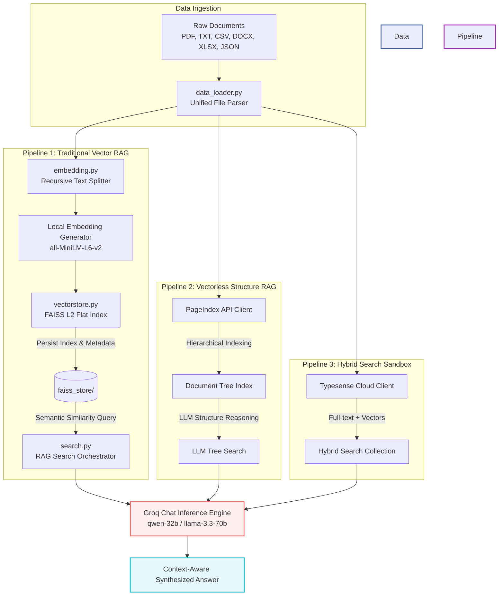

<p align="center">
  
</p>

# 🧠 Production-Ready Modular RAG & Vectorless Reasoning Pipeline

[](https://www.python.org/)
[](https://github.com/langchain-ai/langchain)
[](https://github.com/facebookresearch/faiss)
[](https://groq.com/)
[](https://pageindex.ai/)
[](LICENSE)

A clean, modular, and high-performance **Retrieval-Augmented Generation (RAG)** toolkit. This repository contains both traditional Vector-based RAG implementations (using FAISS, local Sentence Transformers, and Groq-hosted LLMs) and next-generation, structure-aware **Vectorless RAG** engines (using PageIndex). It is designed to act as a production blueprint for document parsing, indexing, semantic querying, and synthesis.

---

## 🗺️ Architectural Paradigm

This repository provides three distinct pipelines tailored for different search and retrieval demands:



---

## ✨ Core Features

*   **Multi-Format Document Parsing**: Out-of-the-box loading and layout extraction for **PDF**, **TXT**, **CSV**, **Excel** (`.xlsx`), **Word** (`.docx`), and **JSON** files via LangChain's unified loaders.
*   **Semantic Text Chunking**: Context-preserved splitting using `RecursiveCharacterTextSplitter` configured with overlapping chunk boundaries to prevent loss of context.
*   **Local Embedding Pipelines**: Locally computed semantic embeddings using the highly optimized HuggingFace `sentence-transformers` library (default: `all-MiniLM-L6-v2`, yielding 384-dimensional dense vectors).
*   **FAISS Vector Storage**: Lightweight, low-overhead index persistence and fast $L^2$ similarity querying via CPU-optimized **FAISS**.
*   **Groq API Orchestration**: Dynamic prompt-assembly and token-efficient response synthesis using Groq's high-speed inference engine (running advanced open models like Qwen-32B or Llama-3).
*   **Vectorless RAG Integration (PageIndex)**: A reasoning-centric pipeline that models files as hierarchical trees (e.g., chapters, tables, sections) rather than raw token lists, eliminating chunking noise and embedding drift.
*   **Typesense Hybrid Indexing**: A robust sandbox configuration for hybrid keyword + vector indexing in high-concurrency environments.

---

## 📂 Project Structure

```directory
├── Data/                       # Ingestion source directory
│   ├── pdf/                    # Multi-page raw PDF documents
│   ├── text_files/             # Plaintext guidelines and logs
│   └── VectorStore/            # Vector store database targets
├── NoteBook/                   # Prototyping & interactive analysis
│   ├── document.ipynb          # Step-by-step document load & chunk visualization
│   └── pdf_loader.ipynb        # In-depth loader benchmark (PyPDF vs. PyMuPDF)
├── src/                        # Core Python Application Package
│   ├── __init__.py             # Namespace initialization
│   ├── data_loader.py          # Multiclass document parsing pipeline
│   ├── embedding.py            # Chunker and local Transformer encoder
│   ├── search.py               # Groq LLM executor and RAG prompt compiler
│   └── vectorstore.py          # FAISS index builder, saver, and query interface
├── assets/                     # Graphical visual aids & diagrams
│   └── rag_banner.png          # Repository banner art
├── app.py                      # Executable demonstration script (Vector RAG)
├── main.py                     # Project CLI helper entrypoint
├── pyproject.toml              # Modern Python packaging configuration (uv/pep621 compatible)
├── requirements.txt            # Explicit dependency requirements manifest
└── PageIndex_Vectorless_RAG.ipynb # Step-by-step tutorial on Reasoning-based Vectorless RAG
└── typesense.ipynb             # Typesense Cloud vector indexing sandbox setup
```

---

## 🚀 Getting Started

### 📋 Prerequisites

*   **Python 3.12+**
*   A **Groq API Key** (obtainable from the [Groq Console](https://console.groq.com/))
*   *(Optional)* A **PageIndex API Key** (obtainable from the [PageIndex Dashboard](https://dash.pageindex.ai/))
*   *(Optional)* **uv**: Fast Python packaging tool (recommended for quick setups)

### ⚙️ Installation & Environment Setup

#### Option A: Using `uv` (Recommended)

`uv` is extremely fast and manages dependencies cleanly:

```bash
# Clone the repository
git clone https://github.com/yourusername/RAG-Retrieval-Augmented-Generation.git
cd RAG-Retrieval-Augmented-Generation

# Create virtual environment and activate
uv venv
source .venv/bin/activate  # Windows: .venv\Scripts\activate

# Install dependencies directly from pyproject.toml
uv pip install -r requirements.txt
```

#### Option B: Standard Python `venv`

```bash
# Clone the repository
git clone https://github.com/yourusername/RAG-Retrieval-Augmented-Generation.git
cd RAG-Retrieval-Augmented-Generation

# Create virtual environment
python -m venv .venv
source .venv/bin/activate  # Windows: .venv\Scripts\activate

# Install requirements
pip install -r requirements.txt
```

### 🔑 Configuration

Create a `.env` file in the project root:

```env
GROQ_API_KEY="gsk_your_groq_api_key_goes_here"
PAGEINDEX_API_KEY="pi-your_pageindex_api_key_goes_here"
```

---

## 💻 Programmatic Usage

### 1. Unified Vector RAG Pipeline

You can run the full standard pipeline locally by executing `app.py`:

```bash
python app.py
```

Under the hood, the system executes the following steps:

```python
from src.data_loader import load_all_documents
from src.vectorstore import FaissVectorStore
from src.search import RAGSearch

# Step 1: Parse all files under Data/
docs = load_all_documents("Data")

# Step 2: Initialize vector store and build index (automatically chunk & embed)
store = FaissVectorStore(persist_dir="faiss_store")
store.build_from_documents(docs)

# Step 3: Instantiate RAG executor with Groq Orchestration
rag_search = RAGSearch(persist_dir="faiss_store", llm_model="qwen/qwen3-32b")

# Step 4: Run similarity search and LLM synthesis
query = "Explain key concepts of Distributed Systems"
answer = rag_search.search_and_summarize(query, top_k=3)

print(f"Synthesized Answer:\n{answer}")
```

### 2. Sandbox Jupyter Playgrounds

Explore experimental and structure-aware architectures in the interactive notebooks:

*   **[PageIndex_Vectorless_RAG.ipynb](file:///Users/nishantsingh04/Documents/RAG-Retrieval-Augmented-Generation/PageIndex_Vectorless_RAG.ipynb)**: Complete guide on RAG without vector embeddings or arbitrary split boundaries. This workflow uploads documents to PageIndex, builds tree hierarchies, and retrieves matching blocks using LLM reasoning.
*   **[typesense.ipynb](file:///Users/nishantsingh04/Documents/RAG-Retrieval-Augmented-Generation/typesense.ipynb)**: Detailed guide on configuring Typesense Cloud collections, ingesting structured data fields, and performing high-speed keyword-semantic hybrid searching.
*   **[NoteBook/pdf_loader.ipynb](file:///Users/nishantsingh04/Documents/RAG-Retrieval-Augmented-Generation/NoteBook/pdf_loader.ipynb)**: In-depth benchmark comparative testing between PDF loaders (e.g., PyMuPDF vs. PyPDF).

---

## ⚙️ Advanced Customization

### Tweaking Text Splitting
You can change the chunk size and chunk overlap in the constructor of [EmbeddingPipeline](file:///Users/nishantsingh04/Documents/RAG-Retrieval-Augmented-Generation/src/embedding.py#L6):
```python
pipeline = EmbeddingPipeline(
    model_name="all-MiniLM-L6-v2",
    chunk_size=500,     # Adjust based on token density
    chunk_overlap=50    # Adjust based on structural cohesion
)
```

### Choosing Models
The `RAGSearch` class supports standard Groq chat completions. You can pass alternative models like:
*   `llama3-70b-8192` (Meta Llama 3)
*   `mixtral-8x7b-32768` (Mistral AI)
*   `qwen/qwen3-32b` (Qwen)

---

## 📄 License

This repository is distributed under the MIT License. See [LICENSE](LICENSE) for details.
